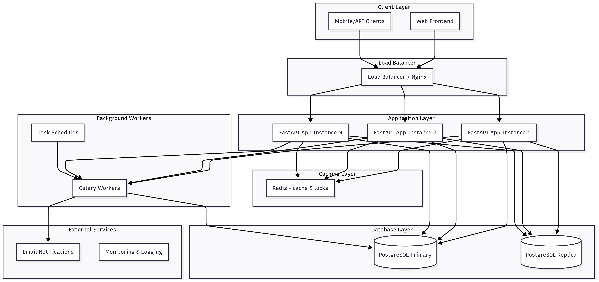

# Evently Booking Platform 🎟️

A **scalable event booking backend** built with **FastAPI + PostgreSQL**, designed to handle high-concurrency ticketing scenarios, prevent overselling, and provide real-time analytics for organizers.

> This project was built as a solution to the Evently Challenge by [**@atlanhq**](https://github.com/atlanhq) .

---

## 🚀 Features

- **High-Concurrency Booking** – Optimistic locking & distributed seat management.
- **Real-Time Availability** – Live seat capacity updates with Redis.
- **User Management** – Secure registration, login (JWT), and profile.
- **Event Management (Admin)** – Create, update, and manage events.
- **Waitlist System** – Auto-notify users when tickets free up.
- **Analytics Dashboard** – Revenue, bookings, and popularity stats.
- **Seat Selection** – Interactive, seat-level booking.
- **Dynamic Pricing** – Demand-based price adjustments.
- **Notifications** – Email alerts for bookings, cancellations, and waitlist events.

---

## 🛠 Tech Stack

- **Backend**: [FastAPI](https://fastapi.tiangolo.com/) (Python 3.12+)
- **Database**: PostgreSQL + SQLAlchemy ORM
- **Cache / Locks**: Redis
- **Background Tasks**: Celery
- **Auth**: JWT (with bcrypt)
- **Testing**: pytest, coverage
- **Code Quality**: Black, MyPy, pre-commit

---

## 📦 Quick Start

### Prerequisites

- Python 3.12+
- [uv](https://docs.astral.sh/uv/) (package manager)
- PostgreSQL
- Redis

### Setup

```bash
# Clone repository
git clone <repo-url>
cd evently-booking-platform

# Install dependencies
uv sync

# Setup environment
cp .env.example .env
# Edit .env with your actual values (see .env.example for reference)
```

### Run

#### Option 1: Direct Python

```bash
uv run uvicorn evently_booking_platform.main:app --host 0.0.0.0 --port 3000 --reload
```

#### Option 2: Docker (Recommended)

```bash
# Development with hot reload
docker-compose up

# Production build
docker-compose -f docker-compose.prod.yml up
```

API Docs available at:

- Swagger: [http://localhost:3000/docs](http://localhost:3000/docs)
- ReDoc: [http://localhost:3000/redoc](http://localhost:3000/redoc)

---

## 📂 Repository Structure

```
evently-booking-platform/
├── evently_booking_platform/   # Core app (APIs, models, services, schemas, utils)
├── tests/                      # Unit & integration tests
├── scripts.py                  # Dev scripts
├── docs/                       # Project documentation
│   ├── CHALLENGE.md
│   ├── ADMIN_GUIDE.md
│   ├── API_DOCS.md
│   ├── ADVANCED_FEATURES.md
│   ├── DESIGN.md
│   └── IMPLEMENTATION_PLAN.md
```

---

## 📑 Documentation

- [Implementation Plan](miscellaneous/IMPLEMENTATION_PLAN.md)
- [Admin Authentication Guide](miscellaneous/ADMIN_AUTHENTICATION_GUIDE.md)
- [API Documentation](miscellaneous/API_DOCUMENTATION.md)
- [Advanced Features](miscellaneous/ADVANCED_FEATURES_DOCUMENTATION.md)
- [System Design](miscellaneous/DESIGN.md)

---

## System Design Overview



## 🐳 Docker

### Development Environment

```bash
# Start all services (app, db, redis, celery)
docker-compose up

# Start in background
docker-compose up -d

# View logs
docker-compose logs -f

# Stop services
docker-compose down
```

### Production Environment

```bash
# Build and run production containers
docker-compose -f docker-compose.prod.yml up

# Run in background
docker-compose -f docker-compose.prod.yml up -d
```

---

## ⚡ Development

Common commands:

```bash
# Start dev server
python scripts.py start
```

---

## 🔐 Environment Variables

Copy `.env.example` to `.env` and configure your values:

```bash
cp .env.example .env
# Edit .env with your actual values
```

**Required variables** (see `.env.example` for complete list):

- `DATABASE_URL` - PostgreSQL connection string
- `REDIS_URL` - Redis connection string
- `SECRET_KEY` - Application secret key
- `CELERY_BROKER_URL` - Celery broker URL
- `CELERY_RESULT_BACKEND` - Celery result backend URL
- `SMTP_USERNAME` - Email service username
- `SMTP_PASSWORD` - Email service password

---

## 📊 Testing (coming soon)

Includes:

- Unit tests (models, services)
- Integration tests (API flows, concurrency)
- Load/concurrency testing

---

## 📜 License

[MIT](LICENSE)

---

✨ **Evently** provides a robust foundation for real-world ticketing systems with **scalability, concurrency safety, and insightful analytics**.
