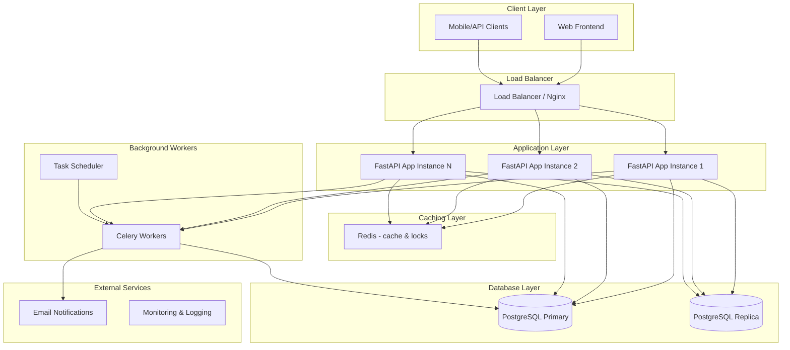
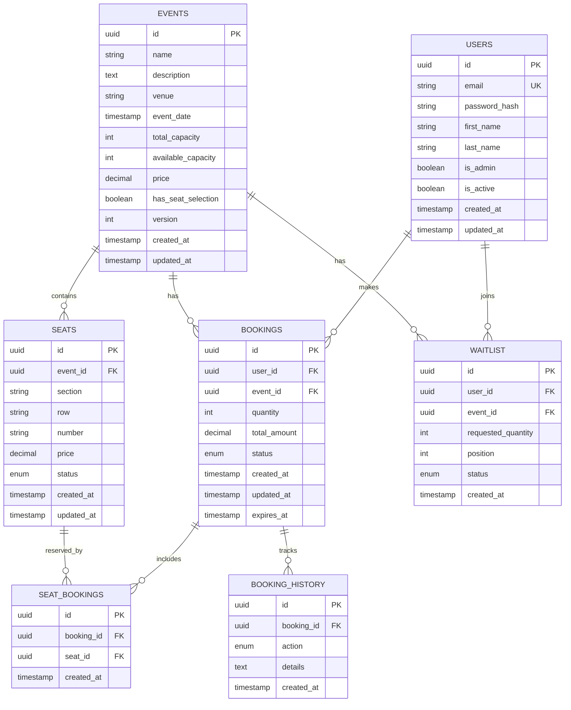

# System Design

This document describes the architecture, design principles, and data modeling for the Evently Booking Platform.

Live Swagger UI (production): https://evently-booking-platform-latest.onrender.com/docs

---

## Design Principles

- **Concurrency Safety** – Optimistic locking, row-level transactions, Redis locks.
- **Scalability** – Horizontal scaling with load balancers + DB connection pooling.
- **Performance** – Redis caching, async operations, efficient indexing.
- **Reliability** – Circuit breakers, retry strategies, background task queues.
- **Separation of Concerns** – Clear modular structure (users, bookings, events, analytics).

---

## High-level Architecture

---

## Concurrency Control Strategy

1. **Database-level**

   - Row-level locking on event capacity.
   - Optimistic locking (version fields).
   - Serializable transactions for critical updates.

2. **Application-level**

   - Redis distributed locks for seat holds.
   - Async request handling for non-blocking I/O.
   - Circuit breakers for external services.

3. **Booking flow**

   - Temporary seat holds with TTL.
   - Atomic booking operations.
   - Compensation for failed transactions.

---

## Core Services

- **Event Service** → CRUD for events, search, filtering, capacity.
- **Booking Service** → Create/cancel bookings, manage waitlist, concurrency safety.
- **User Service** → Registration, login (JWT), profiles.
- **Analytics Service** → Reports, dashboards, advanced trends.
- **Notification Service** → Emails for bookings, cancellations, waitlist spots.

---

## Entity Relationship Diagram (ERD)

---

## Error Handling Strategy

- **Concurrency Errors** → Retry with exponential backoff.
- **Business Logic Errors** → Validation errors with descriptive messages.
- **System Errors** → Circuit breakers, fallback responses.
- **Rate Limiting** → Headers `X-RateLimit-*`.

---

## Monitoring and Observability

**Metrics tracked**

- Booking success rate, cancellation rate, revenue.
- Response times (p50, p95, p99).
- Database connection pool health.
- Cache hit/miss ratios.

**Alerting**

- Critical: booking failures, DB down.
- Warning: high latency, cache misses.
- Business: unusual booking patterns.

---

This design aims to ensure correctness, scalability, and performance under heavy traffic.
